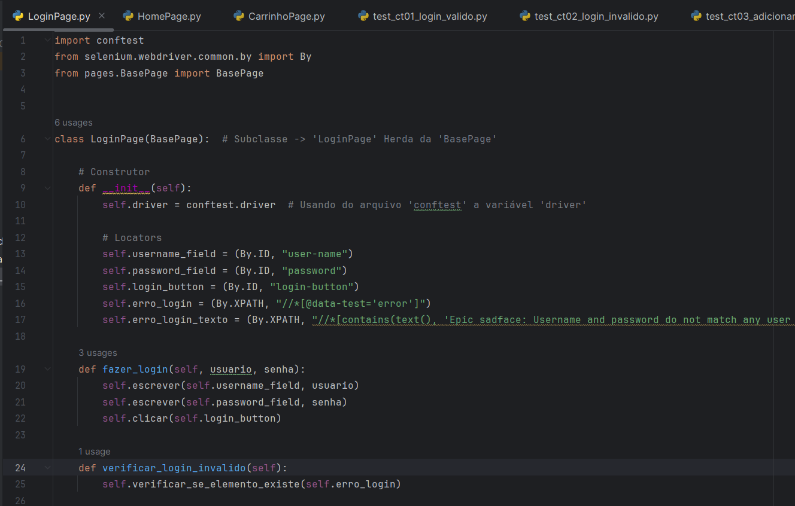

# Automação de testes Web com Selenium Webdriver + Python

https://github.com/user-attachments/assets/bc88a6f9-0e49-400d-ad54-1421e6e8ab01
 
> Selenium Webdriver + Python para automação de testes E2E

 Projeto realizado durante o curso **Automação de testes Web com Selenium Webdriver + Python** da **Udemy** com o instrutor **Leonardo Carvalho**.
 
## 📚 Tópicos

- Automação de Testes Web
- Selenium Webdriver com Python
- Pytest, uma biblioteca/framework de execução de testes do Python
- Page Objects, o padrão de projetos para testes automatizados mais usado no mercado
- Como mapear elementos de forma eficaz, e como usar o XPath corretamente
- Boas práticas de automação de testes
- Como criar um framework de automação de testes web do zero, sendo ele de fácil manutenção e com muito reaproveitamento de código

## 🔧 Ferramentas e Tecnologias

- Python (`v3.11.5`)
- Selenium (`v4.17.2`)
- Pytest (`v8.0.0`)
- pip (`v24.0`)

## 🔧 Testes

- Execute `pytest .\tests\test_ct01_login_valido.py` para executar o teste no modo interativo.
- Execute `pytest .\tests\test_ct02_login_invalido.py` para executar o teste no modo interativo.
- Execute `pytest .\tests\test_ct03_adicionar_produtos_carrinho.py` para executar o teste no modo interativo.

## 🔗 Contato

mykallella@gmail.com
